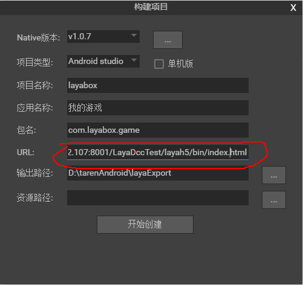
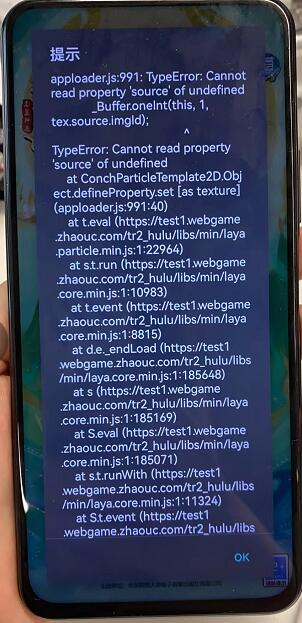
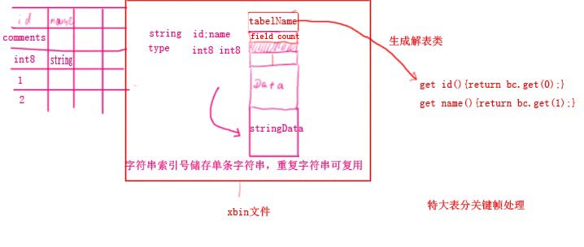
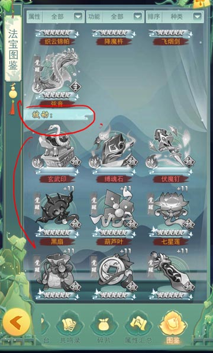

文档地址  
https://ldc2.layabox.com/doc/?language=zh&nav=zh-ts-6-2-0  
1.node 版本不要低于下面版本
```
$ node -v
v4.2.0
```

2.安装layadcc  
```
npm install -g layadcc
```

```
layadcc 资源目录 [options]
options:
    -cache 生成资源包.
    -lwr 文件路径全部转为小写。（一般不需要）
    -url url 如果要打包资源的话，对应的url.
    -cout outpath 打包资源的输出目录，如果不设置的话，就是在资源目录下。
例如:
   layadcc d:/game/wow -cache -url www.game.com
```
将cache文件夹放到main/assets/cache位置
在资源服务器根目录下面
```
layadcc .
```
会生成update较验文件

allfiles.txt 所有的资源文件的相对路径。
assetsid.txt 本次dcc统计的整个资源包的校验码。
filetable.bin dcc主文件，里面是每个文件的校验值。
filetable.txt 文本格式的dcc文件，除了前三行，每一行代表一个文件和对应的校验值，与allfiles.txt正好对应起来，即第4行对应的文件是allfiles.txt的第一行。
filetable1.txt 这个文件不再使用。


```
http://192.168.2.107/LayaDccTest/res/

layadcc d:/LayaDccTest/res -cache -url http://192.168.2.107:8001/LayaDccTest/res/

```

打印 `found the file in the package:` 就表示对应的资源是从包中获取的，没有去网络下载，看到这个日志就表示打包资源成功。如果打的单机版，则所有资源都应该有这个打印，不应该有任何下载。

https://www.233tw.com/laya/54553

# node build.js命令行生成替换DCC的资源的APK包
```
1.将需要layadcc的文件放在D:\github\LayaDccTest\layah5\ddcfold目录下
2.
cd D:\github\LayaDccTest
node build.js "https://test1.webgame.zhaouc.com/fq4_hulu/index_native.html" 

apk生成在build.js同级目录
```

或者直接执行`layaddc&生成apk.bat`生成

在Laya构建app时，URL不要用默认的，默认的网址就是显示上面这个扫码界面。 改成自己的地址(http://192.168.2.107:8001/LayaDccTest/layah5/bin/index.html)  
  
appConfig.js资源路径
```
basePath:"https://test1.webgame.zhaouc.com/tr2_hulu/assets/",  //assets路径、cdn路径
```
生成资源cache的bat

layadcc D:/github/LayaDccTest/layah5/dccfold -cache -url https://test1.webgame.zhaouc.com/fq4_hulu/index_native.html

**LayaNative设置多种字体**
```
let ttfloader:Laya.TTFLoader=new Laya.TTFLoader();
ttfloader.fontName="myfont1";
ttfloader.load("comic.ttf");
ttfloader.complete=Laya.Handler.create(this,()=>{
        let txt:Laya.Text=new Laya.Text();
        txt.text="我是新的字体CBA";
            txt.font="comic";
        txt.fontSize=64;
        Laya.stage.addChild(txt);
})
```

**android studio连接手机**
[https://www.cnblogs.com/oreox/p/10662066.html]

# Laya 1.7.17版本的Native相关BUG

报错1.
`Waring! _loadFromAssets returns incorrect contents! what happened!`

报错2.
2022-02-22 11:07:32.967 24957-24983/com.kafeiniu.hlw E/LayaBox: 错误：图片大小超过2048，无法处理！！！

**BUG1 闪退**  
原因1:drawToCanvas在原生模式(native)下存在内存泄露的BUG
https://ask.layabox.com/question/41587  
不要使用该接口

**BUG2 Sprite的render接口在native失效**  
避免用super.render()这个接口

**BUG3 Laya native版本的websocket有粘包的BUG,要手动把拆开的包组合在一起**

native websocket收到buffer长度被截取 不用native 网页或者直接包app都是正常的,单个包不能超过4096 bytes 解决方案 自行组合协议包
定义协议头结构
```
协议号      Uint16
协议包长度  Uint32
协议体      ...
```
通过协议包长度来判断是否需要处理粘包操作

组件路径`github\LayaDccTest\layah5\src\JSocket.ts`  
使用案例:
```
socket.on(Laya.Event.MESSAGE,socket,onData);
let ms new MJSocketParse(Protocol.onMessage);
function onData(data:ArrayBuffer){
    byteResp.clear();
    byteResp.writeArrayBuffer(data,0,data.byteLength)
    byteResp.pos =0;
    ms.run(byteResp);
}
```

**BUG4 接口getPixels的Native环境下没有检查拾取不到像素的情况**  
代码`var arraybuffer=temp.source.getImageData(x,y,width,height);`
在拾取不到像素的时候,这个arraybuffer可能为null引起的

```
//重构Texture的getPixels的方法
Laya.Texture.prototype.getPixels=function(x,y,width,height){
    if (Laya.Render.isConchApp){
        var temp=this.bitmap;
        if (temp.source && temp.source.getImageData){
            var arraybuffer=temp.source.getImageData(x,y,width,height);
            if(arraybuffer){
                var tUint8Array=new Uint8Array(arraybuffer);
                return /*__JS__ */Array['from'](tUint8Array);
            }
        }
        return null;
        }else if (Laya.Render.isWebGL){
        return Laya.RunDriver.getTexturePixels(this,x,y,width,height);
        }else {
        Laya.Browser.canvas.size(width,height);
        Laya.Browser.canvas.clear();
        Laya.Browser.context.drawTexture(this,-x,-y,this.width,this.height,0,0);
        var info=Laya.Browser.context.getImageData(0,0,width,height);
    }
    return info.data;
}
```
BUG5  
  
Native模式Particle2D不支持。不使用粒子即可.

# 命令行编译
配置命令行参考[https://github.com/jiangjieqim/jdoc/blob/master/android_studio%E5%91%BD%E4%BB%A4%E8%A1%8C%E6%89%93%E5%8C%85%E6%96%B9%E6%B3%95.md]

命令行脚本编译路径:  
D:\github\LayaDccTest\layanatvie\layabox\android_studio\app\编译.bat ,编译会生成在..\app\build\outputs\apk\release\app-release.apk这里

*命令行第2种方式打包.layaddc&生成apk.bat*  
将需要layadcc的文件放在\\layah5\\ddcfold目录下
```
node build.js "https://test1.webgame.zhaouc.com/fq4_hulu/index_native.html"
```
命令行报错解决
```
FAILURE: Build failed with an exception.

* What went wrong:
A problem occurred configuring project ':app'.
> SDK location not found. Define location with sdk.dir in the local.properties file or with an ANDROID_HOME environment variable.

* Try:
Run with --stacktrace option to get the stack trace. Run with --info or --debug option to get more log output. Run with --scan to get full insights.

* Get more help at https://help.gradle.org
```
配置SDK目录D:\github\LayaDccTest\layanatvie\layabox\android_studio\local.properties
```
## This file must *NOT* be checked into Version Control Systems,
# as it contains information specific to your local configuration.
#
# Location of the SDK. This is only used by Gradle.
# For customization when using a Version Control System, please read the
# header note.
#Fri May 20 11:22:18 CST 2022
sdk.dir=D\:\\android\\sdk
```
# xbin文件
   

# 自定义非规则的排版list.JListCustom
参考类`docimg/list.JListCustom.js`  
当容器内的对象数量超多，会卡顿。  
解决方案:用Panel实现,Panel进行滑动时，只显示可是区域在舞台,
移除可视区域Laya.Pool.recover回收
   
        
