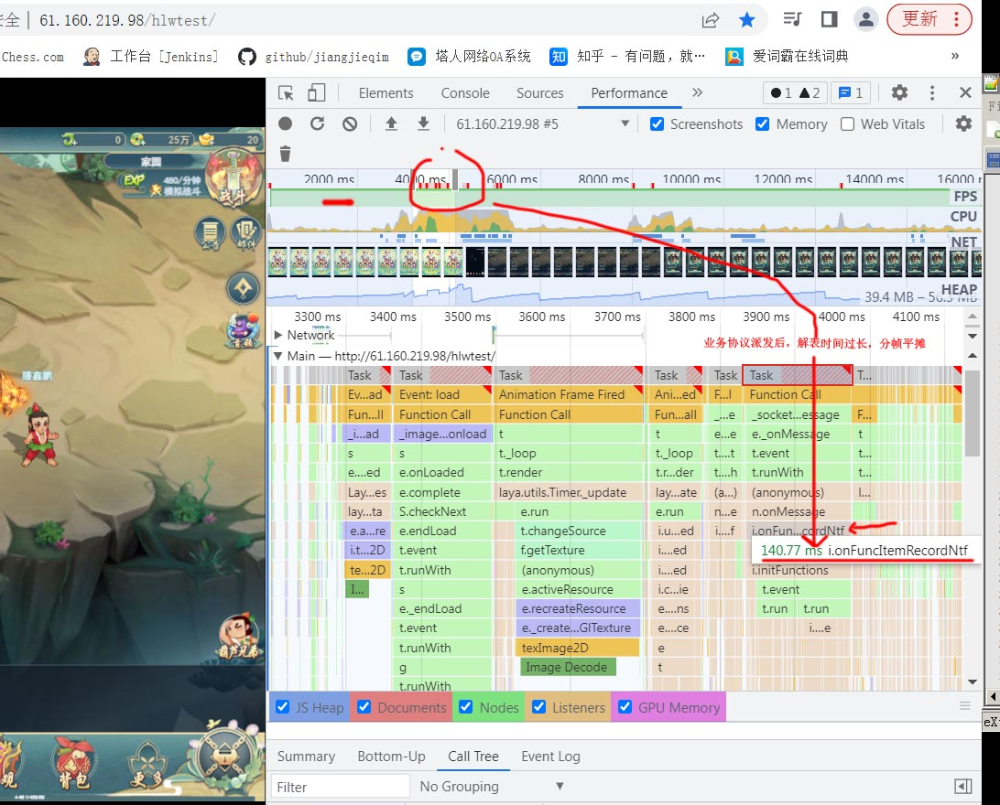

# 内存偏小的机型处理方案
问题:GC引发图集重新加载，Texture闪烁问题  
`策略调整autoReleaseMaxSize值`
```
laya.core.js
/**
*Config 用于配置一些全局参数。如需更改，请在初始化引擎之前设置。
*/
//class Config
var Config=(function(){
	function Config(){}
	__class(Config,'Config');
	Config.WebGLTextCacheCount=500;
	Config.atlasEnable=false;
	Config.showCanvasMark=false;
	Config.animationInterval=50;
	Config.isAntialias=false;
	Config.isAlpha=false;
	Config.premultipliedAlpha=true;
	Config.isStencil=true;
	Config.preserveDrawingBuffer=false;
	return Config;
})()
```

```
ResourceManager
/** 是否启用自动释放机制。*/
autoRelease: boolean;

/**自动释放机制的内存触发上限,以字节为单位。*/
autoReleaseMaxSize: number;
```
laya.core.js 6895
```
/**
*垃圾回收。
*@param reserveSize 保留尺寸。
*/
__proto.garbageCollection=function(reserveSize){
```


文档地址  
https://ldc2.layabox.com/doc/?language=zh&nav=zh-ts-6-2-0  
1.node 版本不要低于下面版本
```
$ node -v
v4.2.0
```

2.安装layadcc  
```
npm install -g layadcc
```

```
layadcc 资源目录 [options]
options:
    -cache 生成资源包.
    -lwr 文件路径全部转为小写。（一般不需要）
    -url url 如果要打包资源的话，对应的url.
    -cout outpath 打包资源的输出目录，如果不设置的话，就是在资源目录下。
例如:
   layadcc d:/game/wow -cache -url www.game.com
```
将cache文件夹放到main/assets/cache位置
在资源服务器根目录下面
```
layadcc .
```
会生成update较验文件

allfiles.txt 所有的资源文件的相对路径。
assetsid.txt 本次dcc统计的整个资源包的校验码。
filetable.bin dcc主文件，里面是每个文件的校验值。
filetable.txt 文本格式的dcc文件，除了前三行，每一行代表一个文件和对应的校验值，与allfiles.txt正好对应起来，即第4行对应的文件是allfiles.txt的第一行。
filetable1.txt 这个文件不再使用。


```
http://192.168.2.107/LayaDccTest/res/

layadcc d:/LayaDccTest/res -cache -url http://192.168.2.107:8001/LayaDccTest/res/

```

打印 `found the file in the package:` 就表示对应的资源是从包中获取的，没有去网络下载，看到这个日志就表示打包资源成功。如果打的单机版，则所有资源都应该有这个打印，不应该有任何下载。

https://www.233tw.com/laya/54553

# node build.js命令行生成替换DCC的资源的APK包
```
1.将需要layadcc的文件放在D:\github\LayaDccTest\layah5\ddcfold目录下
2.
cd D:\github\LayaDccTest
node build.js "https://test1.webgame.zhaouc.com/fq4_hulu/index_native.html" 

apk生成在build.js同级目录
```

或者直接执行`layaddc&生成apk.bat`生成

在Laya构建app时，URL不要用默认的，默认的网址就是显示上面这个扫码界面。 改成自己的地址(http://192.168.2.107:8001/LayaDccTest/layah5/bin/index.html)  
  
appConfig.js资源路径
```
basePath:"https://test1.webgame.zhaouc.com/tr2_hulu/assets/",  //assets路径、cdn路径
```
生成资源cache的bat

layadcc D:/github/LayaDccTest/layah5/dccfold -cache -url https://test1.webgame.zhaouc.com/fq4_hulu/index_native.html

**LayaNative设置多种字体**
```
let ttfloader:Laya.TTFLoader=new Laya.TTFLoader();
ttfloader.fontName="myfont1";
ttfloader.load("comic.ttf");
ttfloader.complete=Laya.Handler.create(this,()=>{
        let txt:Laya.Text=new Laya.Text();
        txt.text="我是新的字体CBA";
            txt.font="comic";
        txt.fontSize=64;
        Laya.stage.addChild(txt);
})
```

**android studio连接手机**
[https://www.cnblogs.com/oreox/p/10662066.html]

# Laya 1.7.17版本的Native相关BUG

报错1.
`Waring! _loadFromAssets returns incorrect contents! what happened!`

报错2.
2022-02-22 11:07:32.967 24957-24983/com.kafeiniu.hlw E/LayaBox: 错误：图片大小超过2048，无法处理！！！

**BUG1 闪退**  
原因1:drawToCanvas在原生模式(native)下存在内存泄露的BUG
https://ask.layabox.com/question/41587  
不要使用该接口

**BUG2 Sprite的render接口在native失效**  
避免用super.render()这个接口

**BUG3 Laya native版本的websocket有粘包的BUG,要手动把拆开的包组合在一起**

native websocket收到buffer长度被截取 不用native 网页或者直接包app都是正常的,单个包不能超过4096 bytes 解决方案 自行组合协议包
定义协议头结构
```
协议号      Uint16
协议包长度  Uint32
协议体      ...
```
通过协议包长度来判断是否需要处理粘包操作

组件路径`github\LayaDccTest\layah5\src\JSocket.ts`  
使用案例:
```
socket.on(Laya.Event.MESSAGE,socket,onData);
let ms new MJSocketParse(Protocol.onMessage);
function onData(data:ArrayBuffer){
    byteResp.clear();
    byteResp.writeArrayBuffer(data,0,data.byteLength)
    byteResp.pos =0;
    ms.run(byteResp);
}
```

**BUG4 接口getPixels的Native环境下没有检查拾取不到像素的情况**  
代码`var arraybuffer=temp.source.getImageData(x,y,width,height);`
在拾取不到像素的时候,这个arraybuffer可能为null引起的

```
//重构Texture的getPixels的方法
Laya.Texture.prototype.getPixels=function(x,y,width,height){
    if (Laya.Render.isConchApp){
        var temp=this.bitmap;
        if (temp.source && temp.source.getImageData){
            var arraybuffer=temp.source.getImageData(x,y,width,height);
            if(arraybuffer){//这里规避空指针异常
                var tUint8Array=new Uint8Array(arraybuffer);
                return /*__JS__ */Array['from'](tUint8Array);
            }
        }
        return null;
        }else if (Laya.Render.isWebGL){
        return Laya.RunDriver.getTexturePixels(this,x,y,width,height);
        }else {
        Laya.Browser.canvas.size(width,height);
        Laya.Browser.canvas.clear();
        Laya.Browser.context.drawTexture(this,-x,-y,this.width,this.height,0,0);
        var info=Laya.Browser.context.getImageData(0,0,width,height);
    }
    return info.data;
}
```
BUG5  
  
Native模式Particle2D不支持。不使用粒子即可.

# 命令行编译
配置命令行参考[https://github.com/jiangjieqim/jdoc/blob/master/android_studio%E5%91%BD%E4%BB%A4%E8%A1%8C%E6%89%93%E5%8C%85%E6%96%B9%E6%B3%95.md]

命令行脚本编译路径:  
D:\github\LayaDccTest\layanatvie\layabox\android_studio\app\编译.bat ,编译会生成在..\app\build\outputs\apk\release\app-release.apk这里

*命令行第2种方式打包.layaddc&生成apk.bat*  
将需要layadcc的文件放在\\layah5\\ddcfold目录下
```
node build.js "https://test1.webgame.zhaouc.com/fq4_hulu/index_native.html"
```
命令行报错解决
```
FAILURE: Build failed with an exception.

* What went wrong:
A problem occurred configuring project ':app'.
> SDK location not found. Define location with sdk.dir in the local.properties file or with an ANDROID_HOME environment variable.

* Try:
Run with --stacktrace option to get the stack trace. Run with --info or --debug option to get more log output. Run with --scan to get full insights.

* Get more help at https://help.gradle.org
```
配置SDK目录D:\github\LayaDccTest\layanatvie\layabox\android_studio\local.properties
```
## This file must *NOT* be checked into Version Control Systems,
# as it contains information specific to your local configuration.
#
# Location of the SDK. This is only used by Gradle.
# For customization when using a Version Control System, please read the
# header note.
#Fri May 20 11:22:18 CST 2022
sdk.dir=D\:\\android\\sdk
```
# js压缩混淆 
安装 npm install uglify-js -g
```
uglifyjs code.js -m -o code.min.js
```
```
  -h, --help                  列出使用指南。
                              `--help options` 获取可用选项的详情。
  -V, --version               打印版本号。
  -p, --parse <options>       指定解析器配置选项:
                              `acorn`  使用 Acorn 来解析。
                              `bare_returns`  允许在函数外return。
                                              在压缩CommonJS模块或`.user.js `引擎调用被同步执行函数包裹的用户脚本 时会用到。
                              `expression`  不是解析文件，二是解析一段表达式 (例如解析JSON).
                              `spidermonkey`  输入文件是 SpiderMonkey
                                              AST 格式 (JSON).
  -c, --compress [options]    启用压缩（true/false）/指定压缩配置:
                              `pure_funcs`  传一个函数名的列表，当这些函数返回值没被利用时，该函数会被安全移除。
  -m, --mangle [options]       启用混淆（true/false）/指定混淆配置:
                              `reserved`  不被混淆的名字列表。
  --mangle-props [options]    混淆属性/指定压缩配置:
                              `builtins`  混淆那些与标准JS全局变量重复的名字。
                              `debug`  添加debug前缀和后缀。
                              `domprops`  混淆那些鱼DOM属性名重复的名字。
                              `keep_quoted`  只混淆没括起来的属性名。
                              
                              `regex`  只混淆匹配（该正则）的名字。
                              `reserved`  不需要混淆的名字的列表（即保留）。
  -b, --beautify [options]    是否美化输出（true/false）/指定输出配置：
                              `beautify`  默认是启用.
                              `preamble`  预设的输出文件头部。你可以插入一段注释，比如版权信息。它不会被解析，但sourcemap会因此调整。
                              `quote_style`  括号类型:
                                              0 - auto自动
                                              1 - single单引号
                                              2 - double双引号
                                              3 - original跟随原码
                              `wrap_iife`  把立即执行函数括起来。注意：你或许应禁用压缩配置中的`negate_iife`选项。 
 
 -o, --output <file>         输出文件路径 (默认 STDOUT). 指定 `ast` 或
                                `spidermonkey`的话分别是输出UglifyJS或SpiderMonkey AST。
    --comments [filter]         保留版权注释。默认像Google Closure那样，保留包含"@license"或"@preserve"这样JSDoc风格的注释。你可以传以下的参数：
                                - "all" 保留全部注释
                                - 一个合适的正则，如 `/foo/` 或 `/^!/`，保留匹配到的注释。 
                                注意，在启用压缩时，因为死代码被移除或压缩声明为一行，并非*所有*的注释都会被保留。
    --config-file <file>        从此JSON文件读取 `minify()` 配置。
    -d, --define <expr>[=value] 定义全局变量。
    --ie8                       支持IE8。
                                等同于在`minify()`的`compress`、 `mangle` 和 `output`配置设置`ie8: true`。UglifyJS不会默认兼容IE8。
    --keep-fnames               不要混淆、干掉的函数的名字。当代码依赖Function.prototype.name时有用。
    --name-cache <file>         用来保存混淆map的文件。
    --self                      把UglifyJS本身也构建成一个依赖包
                                (等同于`--wrap UglifyJS`)
    --source-map [options]      启用 source map（true/false）/指定sourcemap配置:
                                `base` 根路径，用于计算输入文件的相对路径。
                                `content`  输入sourcemap。假如的你要编译的JS是另外的源码编译出来的。
                                假如该sourcemap包含在js内，请指定"inline"。 
                                `filename`  输出文件的名字或位置。
                                `includeSources`  如果你要在sourcemap中加上源文件的内容作sourcesContent属性，就传这个参数吧。
                                `root`  此路径中的源码编译后会产生sourcemap.
                                `url`   如果指定此值，会添加sourcemap相对路径在`//#sourceMappingURL`中。
    --timings                   在STDERR显示操作运行时间。
    --toplevel                  压缩/混淆在最高作用域中声明的变量名。
    --verbose                   打印诊断信息。
    --warn                      打印警告信息。
    --wrap <name>               把所有代码包裹在一个大函数中。让“exports”和“global”变量有效。
                                你需要传一个参数来指定此模块的名字，以便浏览器引用。         
 
```


# xbin文件
   

# 自定义非规则的排版list.JListCustom
参考类`docimg/list.JListCustom.js`  
当容器内的对象数量超多，会卡顿。  
解决方案:用Panel实现,Panel进行滑动时，只显示可是区域在舞台,
移除可视区域Laya.Pool.recover回收
   
        
# 分包加载解决方案
登录前置模块用jslist.json定义起来，之后编译发布代码(`改写layacmd publish`)将release切成2个包。
这样首个包比较小。这样不用等全部代码全部加载完成之后再出登录界面，体验会好很多。

# 同图集适当合并排序到一层减少drawcall
# chorme Performance性能调优相关  
   
 如果是大循环占用太久的问题引起的，拆成多帧分帧解析  