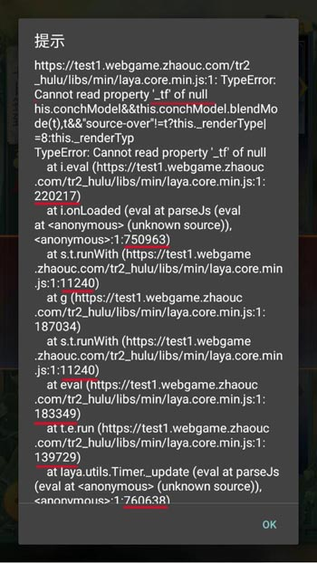
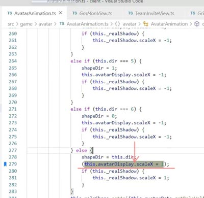

  
原因:在进入游戏的之后的网络断开了，这时候没有配置能够加载到了，所以取地图信息就会空指针异常.

# (0420版本 bug #109680 ) 七日签到最后一次领奖空指针异常
该问题结合论坛https://ask.layabox.com/question/12524查看


* laya.core.min.js 2202217
```
function(){return this._style._tf.scaleX},function(t){var e=this.getStyle();
if(e._tf.scaleX!==t)
```
e._tf对象 e是空指针异常

laya.core.js源码
```
/**X轴缩放值，默认值为1。设置为负数，可以实现水平反转效果，比如scaleX=-1。*/
	__getset(0,__proto,'scaleX',function(){
		return this._style._tf.scaleX;
		},function(value){
		var style=this.getStyle();
		if (style._tf.scaleX!==value){
			style.setScaleX(value);
			this._tfChanged=true;
			this.conchModel && this.conchModel.scale(value,style._tf.scaleY);
			this._renderType |=/*laya.renders.RenderSprite.TRANSFORM*/0x04;
			var p=this._parent;
			if (p && p._repaint===0){
				p._repaint=1;
				p.parentRepaint();
			}
		}
	});
```
`getStyle()返回值null引起的,使用前检测getStyle()非空即可`

* main2.min.js 750963
```
this._realShadow.scaleX=-1)):(n=this.dir,this.avatarDisplay.scaleX=1,
```
this.avatarDisplay.scaleX这里调用堆栈  
参考项目中AvatarAnimation.ts

